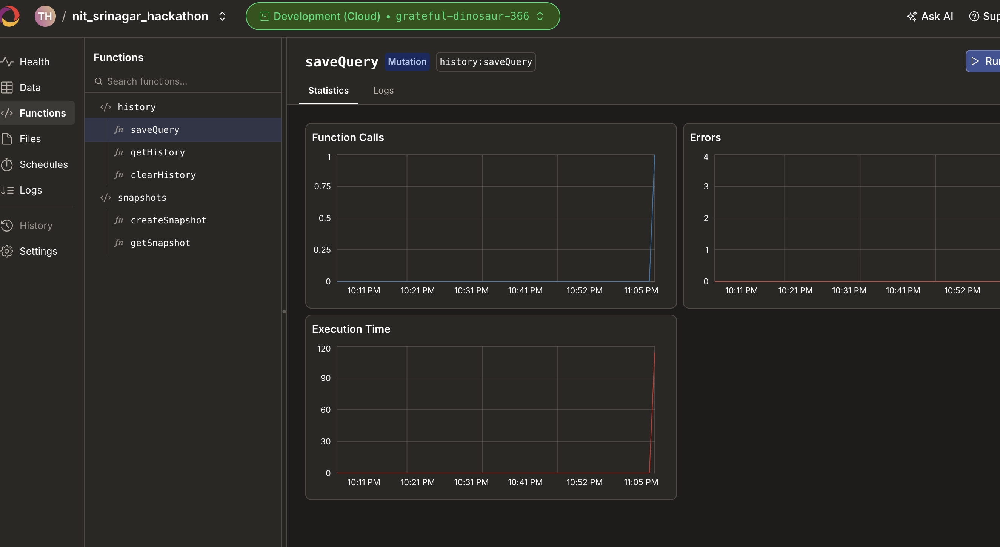

# QueryWise

> Query your company data in plain English. Get instant SQL, charts, and AI-driven insights. No coding needed.

## What is QueryWise?

Query Wise is a next-generation AI-powered data analytics platform designed to democratize data exploration. Instead of relying on data scientists or knowing complex SQL queries, users can simply upload their raw data files (CSV, Excel) and "talk" to their data in natural language.

Behind the scenes, the platform leverages state-of-the-art LLMs (Llama 3.1 via NVIDIA NIM) and a lightning-fast embedded DuckDB engine to parse relationships across multiple datasets, write complex `JOIN` queries on the fly, and execute them instantly. It doesn't just return rows of tabular data—it visually renders the results into interactive charts and generates automatic, summarized business insights so decision-makers can act immediately.

## What it does

- **Overall Features** — Query Wise acts as an advanced, AI-driven Data Analysis SaaS. You can effortlessly bridge natural language to complex underlying SQL operations without knowing any SQL.
- **Single File Analytics** — Upload a CSV or Excel file, ask questions in natural language, and get data visualizations.
- **Multi-File Insights (JOIN up to 4 tables)** — Upload between 2 and 4 distinct files simultaneously. The backend seamlessly parses all tables, infers foreign keys & relationships, and generates advanced JOIN queries to retrieve interconnected data.
- **Conversational Analytics** — After a result, ask follow-ups like “Only Q4” or “Break that down by region.” The previous context loops into the LLM safely to preserve state context.
- **Streaming SQL** — NL→SQL requests are streamed over SSE for a live "typing" effect.
- **AI Business Insights** — A secondary LLM pass analyzes the query output and structures 3 high-impact, actionable business bullet points highlighting trends, anomalies, and metrics.
- **Share Links** — Create sharable URL snapshots containing your dataset's exact visualization state, SQL query, and AI insights.

## Tech stack

| Layer | Technology | Usage Description |
|--------|------------|------------------|
| Frontend | React 18 + Vite + Tailwind CSS | Highly responsive, SaaS design. Includes Glassmorphic navbars, intelligent dropzones, and dark-mode toggle functionality. |
| Charts | Recharts + html2canvas | Powerful and reactive D3 wrappers configured for Bar, Line, Pie, and Scatter visualization. Ability to snapshot to PNG. |
| SQL engine | DuckDB (in-process) | Lightning-fast local analytics engine routing standard natural language to `read_csv_auto` optimized streams. Handles multiple in-memory VIEW architectures concurrently. |
| AI Pipeline | NVIDIA NIM (`meta/llama-3.1-70b-instruct`) | The brain of natural language comprehension. Provides lightning-fast response times to convert plain english to strict DuckDB-dialect SQL, along with contextual data insights and schema extraction. |
| Backend | Node.js + Express | Handles asynchronous multi-part `.csv` and `.xlsx` upload streams, SSE query streaming, and DuckDB query execution APIs. |
| Realtime DB / Persistence | Convex | Durable cloud data layer used to persist query history and share snapshots, with in-memory fallback when Convex is not configured. |

## 🏆 Hackathon Partner Technologies

We are proud to build with the tools provided during the Kashmir Hackathon:

- **Convex (what it is):** Convex is a backend platform/database for app data and functions. It gives us durable storage with simple query/mutation APIs.
- **Where we use Convex in QueryWise (current implementation):**
  - Query history persistence from the query API flow (`history:saveQuery`) in `server/routes/query.js`.
  - Share snapshot persistence and retrieval (`snapshots:createSnapshot`, `snapshots:getSnapshot`) in `server/routes/share.js`.
  - Convex function definitions live in `convex/history.js`, `convex/snapshots.js`, and `convex/schema.js`.
  - Fallback behavior: if Convex is not configured, the app continues with in-memory storage.
- **Cursor Pro:** The primary AI-powered IDE that significantly accelerated the entire development lifecycle of this project.

### Convex Dashboard



## Environment variables

This project uses **separate env files** for server and client.

Create `server/.env`:

```bash
NVIDIA_NIM_API_KEY=<ADD_YOUR_KEY>
CONVEX_URL=https://your-project.convex.cloud
PORT=3001
UPLOAD_DIR=./tmp/uploads
NODE_ENV=development
```

Create `client/.env`:

```bash
VITE_API_URL=http://localhost:3001
VITE_CONVEX_URL=https://your-project.convex.cloud
```

| Variable | Where | Purpose |
|----------|--------|---------|
| `NVIDIA_NIM_API_KEY` | `server/.env` | Required for NL→SQL inference and AI Insight generation. |
| `CONVEX_URL` | `server/.env` | Convex deployment URL used by backend to persist query history and share snapshots. |
| `PORT` | `server/.env` | API port (default `3001`). |
| `UPLOAD_DIR` | `server/.env` | Directory used to store uploaded files temporarily. |
| `NODE_ENV` | `server/.env` | Runtime mode (`development` or `production`). |
| `VITE_API_URL` | `client/.env` | Backend API base URL. |
| `VITE_CONVEX_URL` | `client/.env` | Optional client-side Convex URL (reserved for direct client integration). |

## Setup & Run

We've configured `concurrently` so you only need one command!

```bash
# From the root directory:
npm install
npm run dev
# Both the frontend and backend servers will boot simultaneously!
# Frontend → http://localhost:5173
# Backend → http://localhost:3001
```

Open **http://localhost:5173** and head to **`/workspace`**.

## Demo Execution Strategy

To demonstrate the power of Query Wise, simply toggle to **Multiple files (JOIN)** mode.
1. Upload between 2 and 4 different CSVs (e.g. `Customers.csv`, `Orders.csv`, etc.).
2. You'll instantly see all schemas visualized in the side panel. 
3. The UI will optionally suggest contextual prompts based on the exact columns dynamically detected.
4. Try asking a relational query: *"Join customers to orders and show me the total sum of spending grouped by the customer's region"*
5. The LLM translates this perfectly into DuckDB INNER JOINS. As the table executes, the second LLM pass outputs exactly 3 bullet-point business insights highlighting specific regions performing exceptionally.

## Project layout

```
client/          # Vite + React app (SaaS Dashboard, Recharts, File Upload state)
server/          # Express API (Upload routing, API Query Streams, DuckDB orchestration, NVIDIA NIM)
convex/          # Convex schema + functions used for durable query history and share snapshots
```
